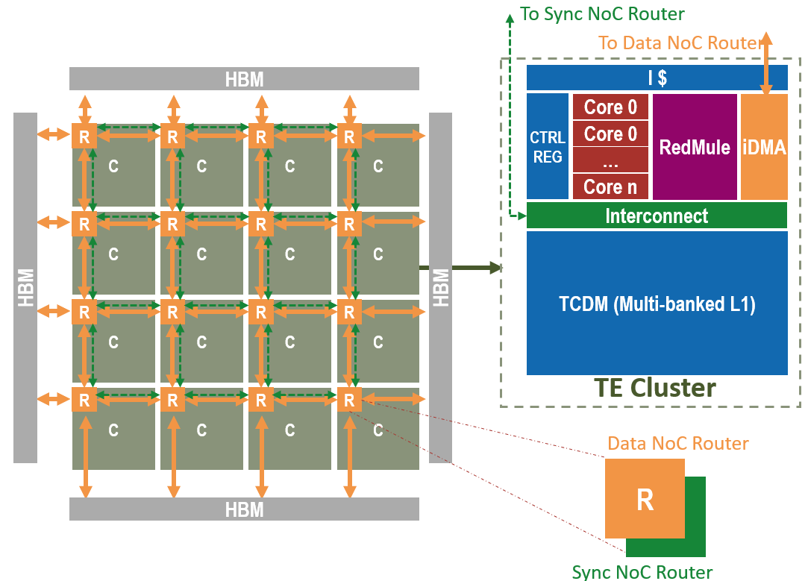

# SoftHier Simulation Model in GVSoC 🚀

## SoftHier Architecture Overview 🏗️



## OS Requirements Installation 🖥️

The following instructions are designed for a fresh installation of Ubuntu 22.04 (Jammy Jellyfish).

To install the required packages, run:

```bash
sudo apt-get install -y build-essential git doxygen python3-pip libsdl2-dev curl cmake gtkwave libsndfile1-dev rsync autoconf automake texinfo libtool pkg-config libsdl2-ttf-dev
```

## Toolchain and Shell Requirements 🔧

GVSoC requires the following tools and versions:

- **g++** and **gcc** versions >= 11.2.0
- **cmake** version >= 3.18.1
- **Python** version >= 3.11.3

Please ensure your toolchain meets these requirements. 

Also please make sure you are using the bash shell for SoftHier Simulation:

```bash
bash
```

## Getting Started with SoftHier Simulation 🚀

### Clone the Repository and Set Up the Environment 🏁

Follow these steps to set up the SoftHier simulation environment:

1. **Clone the repository** and navigate into the project directory:

   ```bash
   git clone https://github.com/gvsoc/gvsoc.git -b soft_hier_release soft_hier_release
   cd soft_hier_release
   ```

2. **Initialize the simulator environment** by running:

   ```bash
   source sourceme.sh
   ```

### Build and Run the SoftHier Simulation Model 🧱

1. **Build the SoftHier hardware model**: 🛠️

   ```bash
   make hw
   ```
The default configuration file is located at `soft_hier/flex_cluster/flex_cluster_arch.py`. To use a custom architecture configuration, specify the file path as follows:

   ```bash
   cfg=<path/to/your/architecture/configuration/file> make hw
   ```

2. **Run the simulation** with an example binary: 🎮

   ```bash
   ./install/bin/gvsoc --target=pulp.chips.flex_cluster.flex_cluster --binary examples/SoftHier/binary/example.elf run --trace=/chip/cluster_0/redmule
   ```

   - `--binary`: Specifies the executable binary to be loaded for the SoftHier simulation.
   - `--trace`: Indicates which component's trace logs should be generated during the simulation.


### Build the Default Binary 💾
To build the default binary from the source code in `soft_hier/flex_cluster_sdk/app_example`, run:
   ```bash
   make sw
   ```
The generated binary `sw_build/softhier.elf` and the dump file `sw_build/softhier.dump` will be located in the `sw_build` directory.

### Build a Custom Binary ✏️
To build your own binary:

1. Prepare your source code in a folder with a `CMakeLists.txt` that defines the source files and include paths. For example:
   ```cmake
   # CMakeLists.txt example
   set(SRC_SOURCES
       ${CMAKE_CURRENT_SOURCE_DIR}/main.c
   )
   
   set(SOURCES ${SRC_SOURCES} PARENT_SCOPE)
   set(INCLUDE_DIRS ${CMAKE_CURRENT_SOURCE_DIR}/include PARENT_SCOPE)
   ```

2. Run the following command, replacing `<folder/of/your/code>` with the path to your source code folder:
   ```bash
   app=<folder/of/your/code> make sw
   ```

This will compile the binary using the specified folder. The generated binary `sw_build/softhier.elf` and the dump file `sw_build/softhier.dump` will be located in the `sw_build` directory.


### Build Customized Hardware and Software (Highly Recommended) 🧩

For convenient and flexible development, use the `hs` Makefile target to build both hardware and software together. This is particularly useful for custom architecture configurations and software development. Run:

```bash
cfg=<path/to/your/architecture/configuration/file> app=<folder/of/your/code> make hs
```

We provide example architecture configurations and software source code in the repository. Try the following:

#### Example 1: Hello World 🌍
```bash
cfg=examples/SoftHier/config/arch_test.py app=examples/SoftHier/software/test make hs; make run
```

#### Example 2:  Dataflow 🎯
1. **Systolic GEMM on 512-bit NoC Bus**
   ```bash
   cfg=examples/SoftHier/config/arch_NoC512.py app=examples/SoftHier/software/gemm_systolic make hs; make runv
   ```
2. **Systolic GEMM on 1024-bit NoC Bus**
   ```bash
   cfg=examples/SoftHier/config/arch_NoC1024.py app=examples/SoftHier/software/gemm_systolic make hs; make runv
   ```

#### Example 3:  GEMM with HBM Preloading 🚀
The `examples/SoftHier/assembled/HBM_preload_example/` directory contains:
- **`config/`** – Architecture configuration files.
- **`preload/`** – Preloaded data files.
- **`software/`** – Multi-cluster GEMM software.

1. **Generating HBM Preload Data**
To generate an HBM preload binary from NumPy data, run:
```bash
python examples/SoftHier/assembled/HBM_preload_example/preload/hbm_data.py
```
This will create the preload binary at:
```
examples/SoftHier/assembled/HBM_preload_example/preload/preload.elf
```

2. **Running SoftHier with HBM Preload**
To run SoftHier with the preloaded HBM data, use:
```bash
cfg=examples/SoftHier/assembled/HBM_preload_example/config/arch.py \
app=examples/SoftHier/assembled/HBM_preload_example/software \
pld=examples/SoftHier/assembled/HBM_preload_example/preload/preload.elf \
make hs runv
```

## SoftHier Visualization 📈

To visualize a SoftHier simulation, follow these steps:
1. Run with the `runv` Makefile target.
2. Generate a Perfetto-format trace file using the `pfto` target.
An integrated example
```bash
<args> make hs runv pfto
```

The trace file will be saved at:  
📂 `sw_build/perfetto.json`

To view the trace, open the following URL in your browser:  
👉 [Perfetto UI](https://ui.perfetto.dev/)

## SoftHier Simulator Tutorial 📖

Tutorials are prepared in `tutorial` folder

